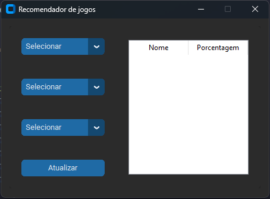

# O programa desenvolvido consiste em um sistema que sugere jogos baseado em escolhas do usuário

## Exemplo:



## Exemplo 2:


### Para a plena funcionalidade favor executar os seguintes passos

### Instalação
O programa utiliza duas bibliotecas externas,utiliza customtkinter e tkinter para a criação de uma interface gráfica.
Para a instalação das bibliotecas execute os seguintes comandos no terminal

```bash
pip install tk
pip install customtkinter
